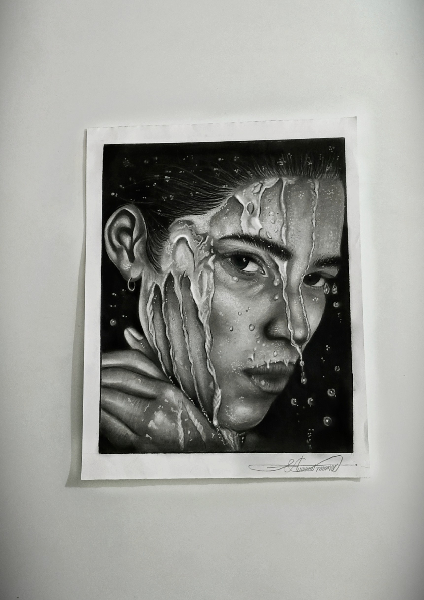
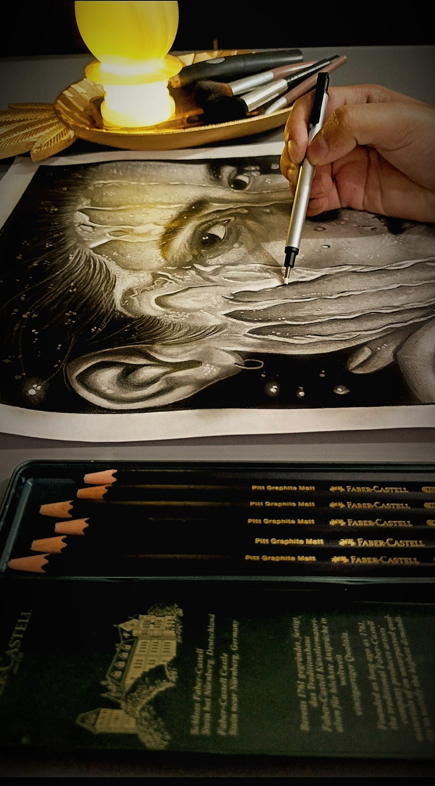

# Hyper-Realistic Sketch: Water Droplets on Face

## Overview
Welcome to the repository showcasing a hyper-realistic traditional artwork captured in `w1.jpg`. Created by 18-year-old hyper-realism artist **Abdullah Irfan**, this piece pushes the boundaries of traditional mediums, focusing heavily on texture contrast, light refraction, and high-fidelity depth on a physical scale.

---

## Art Specifications
* **Artist:** Abdullah Irfan (Instagram: [@the_shadedartist](https://instagram.com/the_shadedartist))
* **Artist Age:** 18 Years Old
* **Medium:** Matte Graphite Pencils
* **Surface Size:** A3 Paper
* **Key Techniques:** 
  * High-contrast value layering using specialized matte graphite to eliminate traditional pencil glare.
  * Precise specular highlight preservation to create the realistic effect of water drops and streaming liquid.
  * Complex micro-texture skin rendering beneath fluid layers.

---

## Visual Preview
The original high-resolution photograph of the artwork is stored in this repository as `w1.jpg`.

  
 

---

## Creative Process & Depth
Executed entirely on A3 paper, the core challenge of this piece was capturing the dual physics of matte skin and highly reflective liquid. By utilizing premium matte graphite, the deep shadows absorb light completely. This creates an intense contrast, allowing the white highlights of the water droplets to pop with three-dimensional realism. Every droplet contains its own micro-gradient of shadow and highlight to perfectly mimic natural light refraction across the face.

For more of my work and behind-the-scenes processes, check out my Instagram profile: **@the_shadedartist**.

---

*Copyright © 2026 Abdullah Irfan (@the_shadedartist). All rights reserved. This image and artwork cannot be used, reproduced, or modified without explicit permission from the artist.*
